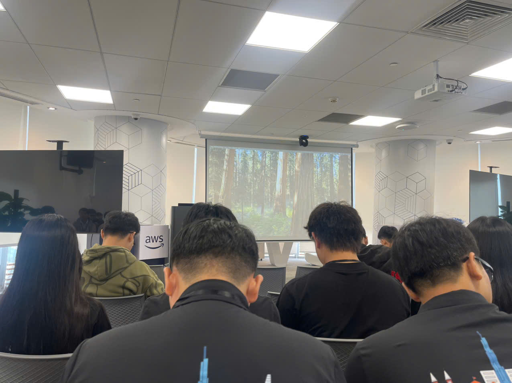
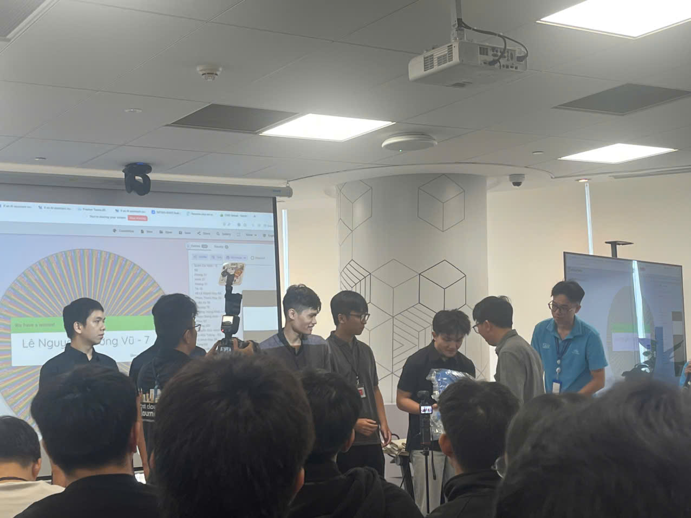
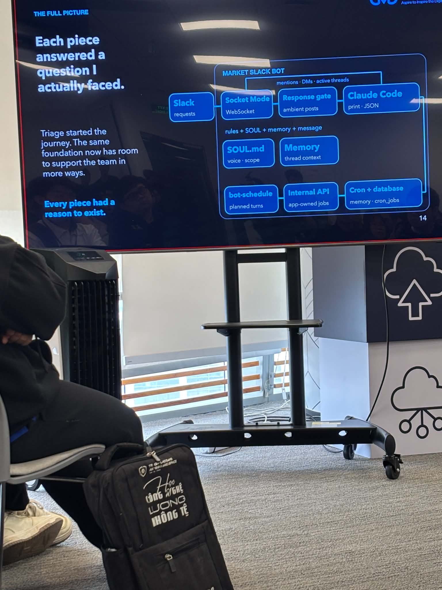
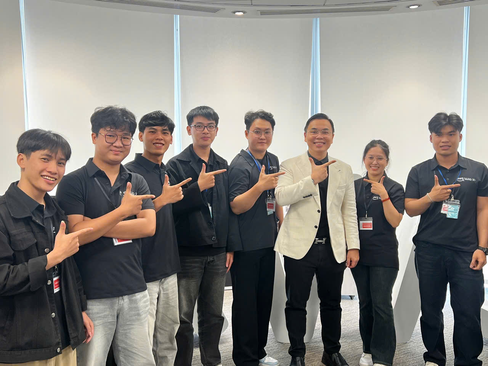

# FCAJ Buildrathon Kickoff

## Event Introduction

On September 26, 2026, I attended the First Cloud AI Journey kickoff event at the AWS office in Ho Chi Minh City.

The event included the following main activities:

- Introduction to First Cloud AI Journey
- Buildrathon Kickoff
- Introduction and interaction with CMC Global
- Sharing session by Mr. Trường about a chatbot project
- Introduction to the Market Slack Bot architecture

---

## 1. Introduction to First Cloud AI Journey

The first part of the event was an introduction to First Cloud AI Journey.

In this part, I was introduced again to the FCAJ program, how the program works, and the activities that members will participate in during the upcoming period.

Through this part, I understood more clearly the program I am participating in and the activities that will take place during the Buildrathon.

---

## 2. Buildrathon Kickoff

After the FCAJ introduction, the official Buildrathon kickoff took place.

The organizers introduced the Buildrathon program and how the teams will participate in the upcoming period.

Through this part, I understood more clearly how the program will continue and how the teams will work together on projects.

---

## 3. Interaction with CMC Global

Next was an interaction session with CMC Global.

In this part, CMC Global introduced their company and some information about their organization.

After the introduction, there was an interaction session with the participants.

CMC Global also gave gifts to participants at the event.

This part mainly helped me learn more about CMC Global and created a more interactive atmosphere during the kickoff.

---

## 4. Mr. Trường's Sharing about a Chatbot Project

The part I was most interested in was Mr. Trường's sharing about a chatbot project.

In this project, there were two teams working in different locations:

- BA working overseas
- Engineers working in Vietnam

Because the two teams were not working in the same location, communication, requirement exchange, and problem handling could become difficult.

From this problem, the team built a Triage Bot to support communication and information processing between the two sides.

Through this sharing session, I could see more clearly how a real problem in the working process can lead to the development of an AI application to support the team.

---

## 5. Triage Bot

The Triage Bot was built to support the processing and classification of information during communication between teams.

During the demo, I saw how the team defined the bot through the `SOUL.md` file.

Some parts I saw in `SOUL.md` included:

- Identity
- Expertise
- Tone & Style
- Skills used
- Domain-specific protocols
- Anti-patterns
- Out of scope

One thing I found interesting was that the bot was not designed to answer everything.

The team clearly defined:

- Who the bot is
- What content the bot can handle
- What content the bot should not handle
- How the bot should respond
- The scope in which the bot operates

Through this part, I understood that building a chatbot is not only about having an AI model, but also about clearly defining the role, scope, and behavior of the bot.

---

## 6. Market Slack Bot Architecture

During the presentation, I also saw the architecture of the Market Slack Bot.

The main flow shown on the slide was:

```text
Slack
  ↓
Socket Mode
  ↓
Response Gate
  ↓
Claude Code
```

Besides the main flow, the system also included:

- SOUL.md
- Memory
- bot-schedule
- Internal API
- Cron + database

### Socket Mode

Socket Mode uses WebSocket to connect with Slack.

### Response Gate

Response Gate is placed before the bot processing section.

From my understanding of the presentation, this component helps control when the bot should respond instead of responding to every message.

### SOUL.md

`SOUL.md` is used to define the bot's role, scope, and behavior.

### Memory

Memory is used to keep the context of threads.

This allows the bot to use previous conversation content instead of processing each message separately.

### Bot Schedule

`bot-schedule` is used for scheduled activities.

### Internal API

The Internal API is used to handle jobs inside the application.

### Cron + Database

Cron + Database supports memory and cron jobs.

---

## 7. What I Found Interesting

There was a sentence on the slide:

> "Each piece answered a question I actually faced."

What I understood from this part is that each component in the system was created to solve a specific problem that the team had faced during the project.

For example:

- Slack is the place where requests are received
- Socket Mode is used for connection
- Response Gate controls responses
- SOUL.md defines the role and scope of the bot
- Memory keeps context
- Internal API handles jobs
- Cron + Database supports scheduled tasks

From this, I understood that when designing a system, it is important to know what problem each component is added to solve.

---

## 8. Practical Technical Experience

The Triage Bot section gave me a more practical view of an AI application.

Previously, when thinking about a chatbot, I mainly thought about the AI model or API.

Through this sharing session, I saw that behind a chatbot there are many other components such as:

- Scope
- Memory
- Context
- API
- Database
- Schedule
- Response control

I also understood that a real AI system needs to be built to fit the workflow of its users.

---

## 9. Connection and Interaction

The event gave me the opportunity to meet and interact with other members of First Cloud AI Journey.

In addition, I listened to the introduction from CMC Global and the practical sharing about the chatbot project.

Through this, I gained more understanding of how teams coordinate with each other during a project.

---

## 10. What I Learned

After the event, I noted several things:

- I understood FCAJ and the Buildrathon more clearly
- I learned more about CMC Global
- I had more opportunities to interact with other members in the program
- I learned more about how a real project can be implemented across multiple teams
- I saw the problems that can happen when BA and Engineers work in different locations
- I learned how a chatbot can support communication between teams
- I understood more about the role and scope of a bot
- I learned how `SOUL.md` can be used to define how a bot operates
- I understood more about the role of Memory and context
- I learned more about the basic architecture of a Slack Bot
- I understood that an AI application includes more than just an AI model

---

## 11. Lessons Learned

The part I remember most from the event was the sharing about the Triage Bot.

From a communication problem between BA and Engineers, the team built a bot to support their work.

From this, I realized that when working on an AI project, the first step should be identifying the problem that needs to be solved, and then choosing an appropriate way to build the system.

I also understood that a real AI application is not only about the model. It also needs supporting components such as memory, API, database, context, and mechanisms to control how the system responds.

---

## 12. Some Photos from the Event

### Kickoff Event Environment



### Triage Bot Project Demo


### FCAJ Buildrathon Kickoff



### SOUL.md Structure Demo



### End of the Event



---

## Summary

The kickoff helped me understand more clearly about FCAJ and the Buildrathon and gave me the opportunity to interact with other members in the program.

The part I was most interested in was the sharing about the Triage Bot and the Market Slack Bot architecture.

Through this part, I understood that an AI application can be built from a real problem and that many components need to work together, not just the AI model.