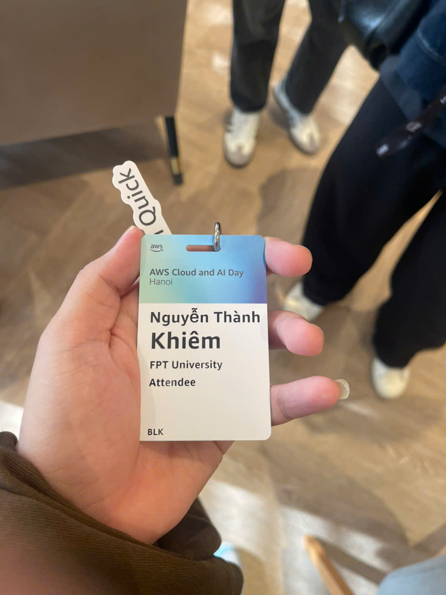
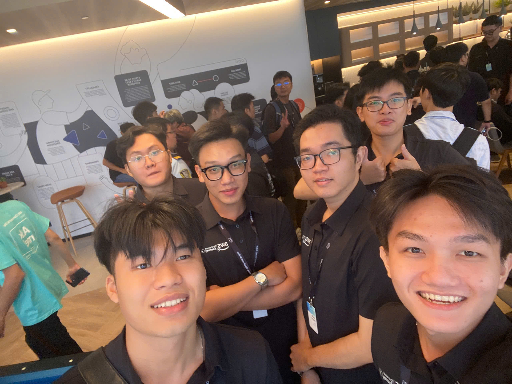
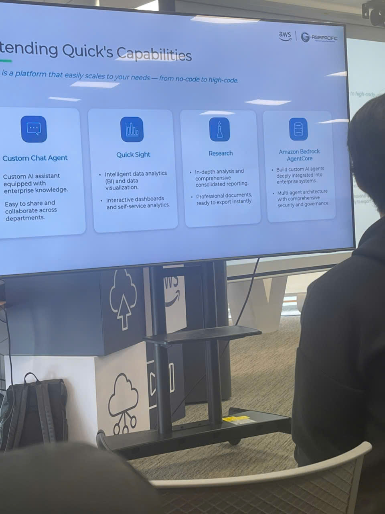
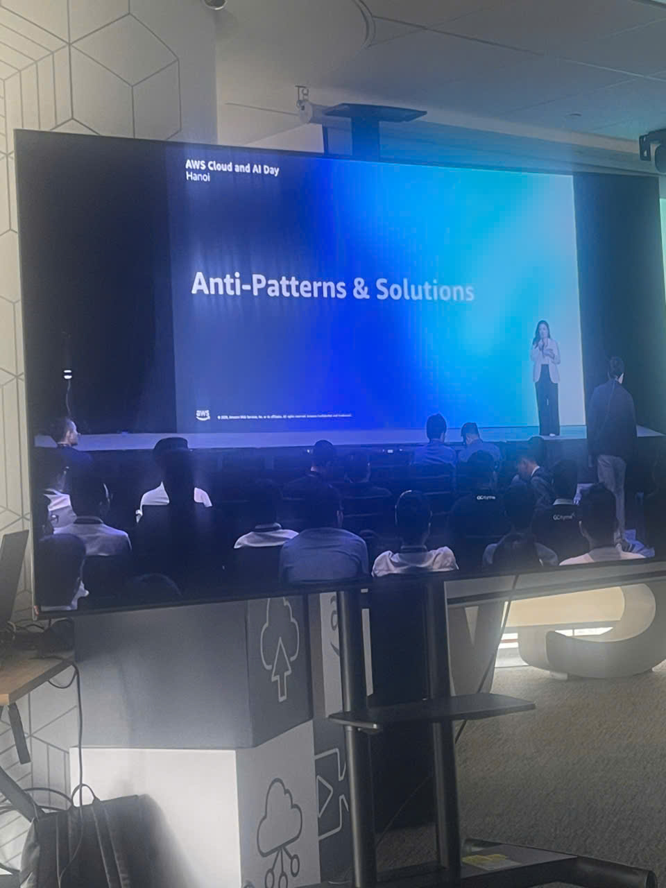
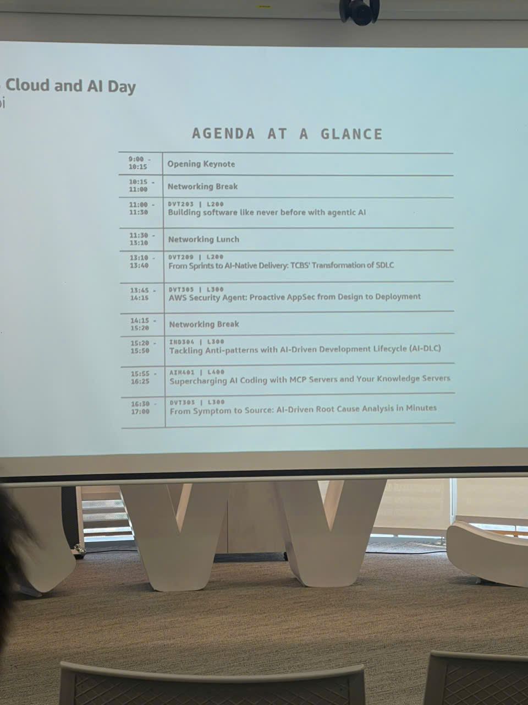
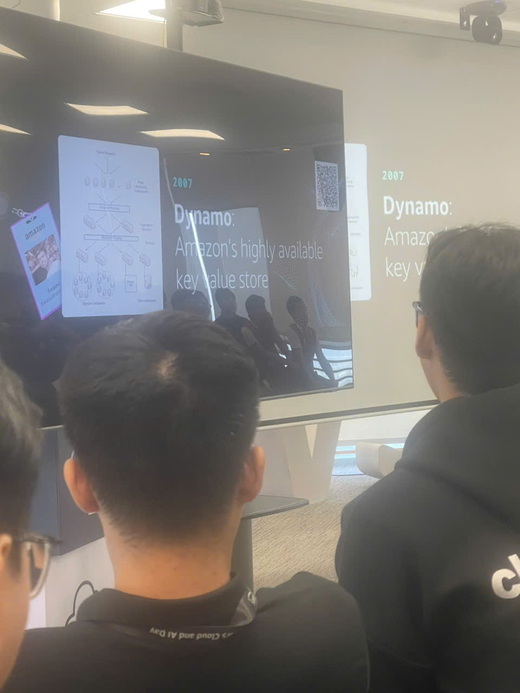

# Event 2: AWS Cloud and AI Day Hanoi

## Event Information

**Event Name:** AWS Cloud and AI Day Hanoi

**Date:** September 29, 2026

**Location:** Hanoi, Vietnam

**My Role:** Attendee

---

## Overview

AWS Cloud and AI Day Hanoi is an event focusing on cloud computing, artificial intelligence, software development, and modern technology solutions. The event provided opportunities to learn about how organizations apply AWS technologies and AI solutions to build scalable, secure, and efficient systems.

During the event, I attended different technical sessions related to cloud architecture, AI development, AI agents, software engineering practices, security, and operational management.

---

## Event Activities

During the event, I participated in several technical presentations and discussions covering different topics:

### 1. Cloud Architecture and Scalability

The event introduced how large-scale systems are designed to achieve high availability and scalability. One of the topics discussed was Amazon Dynamo, a highly available key-value storage system developed by Amazon to solve scalability challenges.

Through this session, I gained a better understanding of how distributed systems handle large amounts of data while maintaining reliability and performance.

---

### 2. AI Agent and Modern AI Development

A major topic of the event was the development of AI-native applications and AI agents.

The speakers discussed the potential of AI agents in supporting software development, automation, and business processes. The session also highlighted important challenges when applying AI systems, such as controlling model outputs, maintaining quality, and ensuring human review in critical processes.

I learned that building AI applications requires not only using AI models but also designing proper workflows, verification processes, and system architectures.

---

### 3. AI-Assisted Software Development

The event introduced new approaches to software development with AI support, including AI coding assistants and agent-based development workflows.

The speakers shared the importance of combining AI tools with traditional software engineering practices, such as requirement analysis, testing, security checking, and deployment processes.

This helped me understand that AI can improve development productivity, but developers still need strong technical knowledge and proper engineering processes.

---

### 4. Security and Cloud Operations

Another important topic was cloud security and operational challenges.

The sessions introduced security issues such as vulnerabilities in software systems, security testing methods, and the importance of monitoring and governance in cloud environments.

I learned more about how organizations manage security risks through automated tools, security processes, and continuous improvement.

---

### 5. AWS and AI Solutions

The event also introduced several AWS services and AI-related solutions, including tools for AI development, data analysis, monitoring, and enterprise applications.

The presentations showed how cloud platforms can support organizations in developing and deploying AI systems more effectively.

---

## Key Takeaways and Learning Outcomes

After participating in AWS Cloud and AI Day Hanoi, I gained several valuable insights:

- Improved my understanding of cloud computing concepts and scalable system architecture.
- Learned about current trends in AI development, especially AI agents and AI-native applications.
- Understood the importance of combining AI tools with software engineering processes.
- Learned more about security, monitoring, and operational challenges in modern cloud environments.
- Developed a broader perspective on how AWS technologies are applied in real-world systems.

---

## Reflection

Participating in AWS Cloud and AI Day Hanoi helped me connect theoretical knowledge with practical applications in the technology industry.

The event not only provided technical knowledge but also changed my perspective on designing applications, modernizing systems, and improving collaboration between technology teams.

Through this experience, I realized the importance of continuously learning new technologies, especially in cloud computing and artificial intelligence, to prepare for future software and AI development projects.

---

## Event Photos

